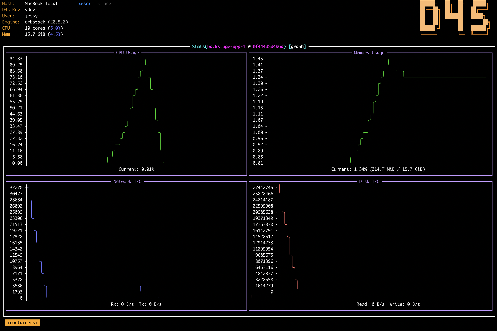

<div align="left" width="100%">
    
</div>


# D-Force (d4s)

D4S (pronounced *D-Force*) brings the power and ergonomics of K9s to the local Docker ecosystem. Stop wrestling with verbose CLI commands and start managing your containers like a pro.

> Manage your Docker Swarm, Compose stacks, and Containers with a fancy, fast, and keyboard-centric Terminal User Interface.


<a target="_blank" href="https://github.com/jr-k/d4s/commit/HEAD"></a>
<a target="_blank" href="https://github.com/jr-k/d4s/stargazers"></a>
<a target="_blank" href="https://github.com/jr-k/d4s/pkgs/container/d4s"></a>

## Screenshots
<div align="left" width="100%">
    
</div>
<br />
<div align="left" width="100%">
    
</div>

## Features

- **Fancy UI**: Modern TUI with Dracula theme, smooth navigation, and live updates.
- **Keyboard Centric**: Vim-like navigation (`j`/`k`), shortcuts for everything. No mouse needed.
- **Full Scope**: Supports **Containers**, **Images**, **Volumes**, **Networks**.
- **Compose Aware**: Easily identify containers belonging to Compose stacks.
- **Swarm Aware**: Supports **Nodes**, **Services**.
- **Powerful Search**: Instant fuzzy filtering (`/`) and command palette (`:`).
- **Live Stats**: Real-time CPU/Mem usage for containers and host context.
- **Advanced Logs**: Streaming logs with auto-scroll, timestamps toggle, and wrap mode.
- **Quick Shell**: Drop into a container shell (`s`) in a split second.
- **Contextual Actions**: Inspect, Restart, Stop, Prune, Delete with safety confirmations.

## Installation

### Homebrew (MacOS / Linux)
```bash
brew install jr-k/d4s/d4s
```
---
### Docker
```bash
docker run --rm --pull always -it -v /var/run/docker.sock:/var/run/docker.sock ghcr.io/jr-k/d4s:latest
```

**You might want to create an alias for quicker usage. For example:**

```bash
echo "alias d4s='docker run --rm --pull always -it -v /var/run/docker.sock:/var/run/docker.sock ghcr.io/jr-k/d4s:latest'" >> ~/.zshrc
```
*After running this, either restart your terminal or run `source ~/.zshrc` (or `source ~/.bashrc` for Bash) to enable the alias.*

---

### Binary Releases (Linux / MacOS / Windows)


> Automated
```bash
curl -fsSL https://d4scli.io/install.sh | sh
```
*The script installs downloaded binary to `$HOME/.local/bin` directory by default, but it can be changed by setting DIR environment variable.*

> Manual

Grab a release from the [releases page](https://github.com/jr-k/d4s/releases) and install it manually.

---

### Scoop (Windows)
```powershell
scoop bucket add d4s https://github.com/jr-k/scoop-d4s
scoop install d4s
```

---

### From Source
>Requirement: Go 1.21+
```bash
git clone https://github.com/jr-k/d4s.git
cd d4s
go build -o d4s cmd/d4s/main.go
sudo mv d4s ~/.local/bin/
```

```bash
# Make the binary accessible then run it
mv d4s ~/.local/bin/
d4s

# Quickly run from source
go run cmd/d4s/main.go
```
---

## Usage
```bash
d4s
d4s version
```

## Contributing

There's still plenty to do! Take a look at the [contributing guide](CONTRIBUTING.md) to see how you can help.

## Discussion / Need help ?

### Join our Discord
[](https://discord.gg/tS2NCEJTUN)

### Open an Issue
[](https://github.com/jr-k/d4s/issues/new/choose)

---
*Built with Go & Tview. Inspired by the legendary K9s.*

*D4s is made possible by a rich set of open source projects and libraries. We are truly thankful to the OSS contributors who generously share their time, care, and effort to support and allow this work.*

